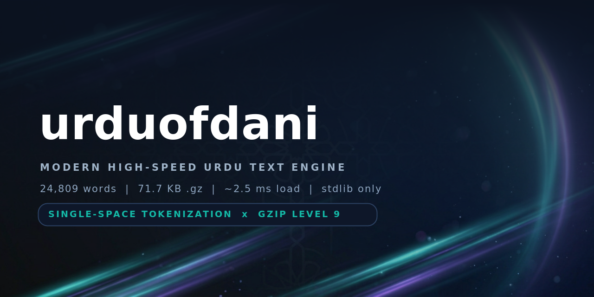

<!-- ═══════════════════════════════════════════════════════════════════════════
     urduofdani · Modern High-Speed Urdu Text Engine
     Repository: forest1fire/urduofdani-dictionary
     ═══════════════════════════════════════════════════════════════════════ -->

<div align="center">


<br>


# urduofdani
### Modern High-Speed Urdu Text Engine

**24,809 curated + morphologically generated Urdu words in a 71.7 KB gzip binary (~2.5 ms load) — including the 99 names of Allah, the prophets, Ahl al-Bayt and the Sahaba — and up to 113,793 words in the unlimited build. No cap, no dependencies, no lag.**

<p>
  <a href="#-quickstart"></a>
  <a href="#-python-api"></a>
  <a href="https://github.com/forest1fire/urduofdani-dictionary/issues"></a>
  <a href="CONTRIBUTING.md"></a>
</p>

<p>
  
  
  
  
  
  
  
  
  
  
  
</p>

<sub><b>Single-Space Tokenization</b> · <b>Gzip (.txt.gz)</b> · <b>Deterministic builds</b> · <b>Windows-first</b> · <b>Stdlib only</b></sub>

</div>

---

## ✨ Highlights

| | |
|---|---|
| 🧠 **24,809 real Urdu words** | Curated across 34 domains + deterministic Urdu morphology (plurals, gender agreement, verb families, agentives, compounds) |
| 🗜️ **72 KB instead of 349 KB** | One line, one space separator, gzip level 9 → **79.5% smaller** (85.7% on the unlimited build) |
| ⚡ **~2.5 ms cold load** | Decompress + split + index 24,809 words in about one frame (14 ms for 113,793) |
| 🎯 **O(1) lookup / O(log n) autocomplete** | `set` membership + binary-search suggestions |
| 🔤 **Arabic → Urdu smart folding** | `كِتاب`, `كتاب`, `کتاب` all resolve to one canonical word |
| 🧩 **Zero dependencies** | Pure Python stdlib: `gzip`, `zlib`, `re`, `unicodedata` — no `pip install`, ever |
| 🪟 **Windows-first engineering** | UTF-8 console, atomic writes, PyInstaller `--onefile` aware, no app freeze |
| 🧾 **Reproducible artifacts** | Identical seeds ⇒ identical SHA-256 |
| 🚀 **Unlimited mode** | `--unlimited --depth 4` = 113.7k words; `--recall` = 2.6 million tokens |
| 🕌 **375 sacred names, protected** | The 99 names of Allah, the prophets, Ahl al-Bayt (including Hazrat Ali's family) and the Sahaba — **never pluralised, suffixed or compounded**, in any mode |

---

## 📚 Table of Contents

1. [The Problem: MB-sized word lists and Windows app lag](#1-the-problem-mb-sized-word-lists-and-windows-app-lag)
2. [The Solution: Single-Space Tokenization + Gzip](#2-the-solution-single-space-tokenization--gzip)
3. [Real Benchmarks](#3-real-benchmarks)
4. [Quickstart (Setup)](#4-quickstart-setup)
5. [Integration: Load `urdu_database.txt.gz` at Runtime](#5-integration-load-urdu_databasetxtgz-at-runtime)
6. [Python API Reference](#6-python-api-reference)
7. [CLI Reference](#7-cli-reference)
8. [Dictionary Coverage](#8-dictionary-coverage)
8b. [Sacred Names (Protected)](#sacred-names-protected)
9. [How the Compiler Works](#9-how-the-compiler-works)
10. [Extending the Dictionary with Your Own Words](#10-extending-the-dictionary-with-your-own-words)
11. [Windows & Performance Notes](#11-windows--performance-notes)
12. [Troubleshooting / FAQ](#12-troubleshooting--faq)
13. [Repository Layout](#13-repository-layout)
14. [Roadmap](#14-roadmap)
15. [License](#15-license)

---

## 1. The Problem: MB-sized word lists and Windows app lag

A plain-text Urdu dictionary is expensive in three different ways:

| Waste | Why it happens | Cost in a real app |
|---|---|---|
| **UTF-8 bloat** | Every Urdu letter (`ا`, `ب`, `پ`, `ٹ`, `ں`) costs **2 bytes** in UTF-8, plus 1 byte for every separator | This 24,589-word lexicon is **346.7 KB** of raw text; the 113,576-word unlimited build is **2.16 MB** |
| **Line / CSV parsing** | `readlines()`, `split(",")`, `csv.reader` allocate a new object per line and re-scan separators | Startup stalls of **hundreds of ms** on cold Windows disks |
| **Disk + antivirus tax** | Thousands of small text files or one huge `.txt` is re-scanned by Windows Defender on every app start | Visible "**not responding**" flicker on the splash screen |

For a Tkinter / PyQt / Flask desktop tool, that shows up as the classic symptom: **the window freezes for a second or two the moment it launches.**

## 2. The Solution: Single-Space Tokenization + Gzip

`urduofdani` attacks all three problems at once.

<p align="center">
  
</p>

### Step 1 — Single-Space Tokenization

Every word in the lexicon is serialised into **one continuous line**, separated by **exactly one ASCII space**:

```text
آؤ آئندہ آئین آئینہ آئیکیں اپ اپنا اپنی ... کمپیوٹر کمپیوٹرز کمپوزر ... یوٹیوب یوم
```

* ✅ **No newlines** (no `\n`, no `\r\n`, no Windows/Linux line-ending mismatch)
* ✅ **No commas, no digits, no punctuation** — the payload is pure Urdu letters + single spaces
* ✅ **No duplicates** — Arabic/Persian look-alike codepoints are folded *before* de-duplication, so `كتاب` and `کتاب` can never both end up in the file

Because there is exactly one delimiter, loading is a single C-level operation:

```python
words = payload.split(" ")   # 10,000+ tokens in well under a millisecond
```

No regex, no CSV parser, no per-line Python loop, no encoding guesses.

### Step 2 — Gzip compression (`.txt.gz`)

Urdu words share a huge amount of structure (common prefixes like `بے‑`, `نا‑`, `ہم‑`, suffixes like `‑وں`, `‑یں`, `‑دار`, `‑مند`). A dictionary is therefore *extremely* compressible. The compiler streams the tokenized payload through `zlib` at **level 9** into a standard **gzip container**, written atomically to `urdu_database.txt.gz`:

```text
346.7 KB  of raw single-line Urdu text
        │  gzip level 9 (DEFLATE) — standard .gz, readable by Python, Node, Java, .NET, 7-Zip
        ▼
 70.8 KB  urdu_database.txt.gz        → 79.6% smaller
```

* The container is a **standard gzip stream**, not a private format — `gzip`, `zcat`, `GZIPInputStream` (Java), `GZipStream` (.NET), `node:zlib` and `7-Zip` all open it.
* The gzip header `MTIME` field is forced to `0`, so the build is **byte-for-byte reproducible** (same seeds → same SHA-256).
* Writing is **atomic** (`tempfile` + `os.replace`), so a crash mid-write can never leave a corrupted database on disk.
* Files go **from MBs to KBs**: the unlimited depth-4 build turns **2.16 MB → 315.4 KB (85.8%)**, and the ratio *improves* as the lexicon grows because morphemes repeat more often.

### Step 3 — Index once, serve instantly

On startup the engine decompresses the 71 KB blob (~2.4 ms), splits it once, and builds a `set` + sorted `list` index. After that:

* membership (`"کمپیوٹر" in engine`) is **O(1)**,
* autocomplete (`engine.suggest("کم")`) is a **binary search — O(log n)**,
* RAM footprint for the whole dictionary is **~2.6 MB** — smaller than one emoji font.

## 3. Real Benchmarks

Measured with `python build_urdu_database.py --benchmark 10` (Python 3.11, x86-64, warm page cache; Windows numbers are typically within ±15%).

| Build | Words | Raw payload (UTF-8) | Committed `.gz` | Saved | Cold load (best) | Peak RAM (loader) | Shipped in repo |
|---|---|---|---|---|---|---|---|
| **Default (balanced)** | **24,809** | 349.1 KB | **71.7 KB** | **79.5%** | **2.48 ms** | 2.64 MB | ✅ `urdu_database.txt.gz` |
| `--unlimited --depth 4` | **113,793** | 2.17 MB | **316.5 KB** | **85.7%** | 13.9 ms | 13.33 MB | ✅ `urdu_database.full.txt.gz` |
| `--exhaustive` | 42,358 | 615.7 KB | 118.4 KB | 80.7% | 7.7 ms | 7.12 MB | on demand |
| `--unlimited --depth 2` | 56,901 | 890.4 KB | 158.0 KB | 82.1% | 9.8 ms | — | on demand |
| `--recall` (machine tier) | **2,596,675** | 68.5 MB | 7.0 MB | 89.3% | 883 ms | 491 MB peak build | on demand |

| Stage | Default (24.6k) | Unlimited d4 (113.6k) | Recall (2.6M) |
|---|---|---|---|
| Compile lexicon (morphology = all the CPU work) | **0.10 s** | 0.55 s | 17.8 s |
| Compress + write `.gz` | **0.04 s** | 0.16 s | ~6 s |
| **Total (in-process)** | **0.14 s** | **0.71 s** | ~24 s |
| Total including Python startup | ~0.18 s | ~0.75 s | — |

> **Memory note.** The builder holds the lexicon in RAM while de-duplicating and
> sorting, so peak RSS scales with the token count: ~120 MB for 113k words,
> ~491 MB for the 2.6M-token recall tier. The shipped builds stay far below that.

> **Why the ratio keeps climbing:** DEFLATE pays off with repetition, and Urdu
> morphology is *extremely* repetitive (‑وں، ‑یں، ‑دار، ‑مند، ‑خانہ). The 24.6k
> default build saves **79.6%**, the 113.6k unlimited build **85.8%**, and the
> 2.6M-token recall tier **89.3%**. A 70 KB file is smaller than one JPEG icon and
> loads in about the time one frame takes to render.

## 4. Quickstart (Setup)

### Requirements

| Item | Requirement |
|---|---|
| Python | **3.8+** (tested on 3.11) — no `pip install` needed, stdlib only |
| OS | Windows 10/11, Linux, macOS |
| Disk | < 1 MB |

### Step 1 — Get the project

```bash
git clone https://github.com/forest1fire/urduofdani-dictionary.git
cd urduofdani-dictionary
```

### Step 2 — Build the database (one command)

```bash
python build_urdu_database.py
```

Expected output:

```text
[urduofdani] lexicon compiled in 0.103s
    + 1_curated                     5,845
    + 2_place                         637
    + 2_tech                        1,742
    + 7_verb_forms                  8,610
    + 9_compounds                   2,438
    + 9b_agentives                  1,883
    = TOTAL                        24,589 unique Urdu words
[urduofdani] wrote urdu_database.txt.gz
    raw      : 346.74 KB
    gzip     : 70.82 KB  (79.6% smaller)
    io time  : 0.037s
    sha256   : 4ac1f2c1…
```

### Step 3 — Verify the artifact (recommended)

```bash
python build_urdu_database.py --no-build --verify --export urdu_database.txt
```

```text
[urduofdani] verifying urdu_database.txt.gz
    [PASS] gzip readable      72516 bytes packed payload
    [PASS] no newline         single line
    [PASS] no comma           comma-free
    [PASS] no digits          digit-free
    [PASS] no duplicates      24589 tokens / 24589 unique
    [PASS] all tokens legal   100% Urdu letters
```

### Step 4 — Load it in your app

See [Section 5](#5-integration-load-urdu_databasetxtgz-at-runtime).

### Optional — build the massive variants

```bash
# 113,576 words / 315 KB - the shipped "full" build (already in this repo)
python build_urdu_database.py --unlimited --depth 4 -o urdu_database.full.txt.gz

# 42,138 words - compounds + agentives + affix families, quality-gated
python build_urdu_database.py --exhaustive

# 2,596,456 tokens / 7 MB - raw maximum recall, machine-oriented
python build_urdu_database.py --recall -o urdu_database.recall.txt.gz
```

**Mode ladder**

| Mode | Words | What it adds | Quality |
|---|---|---|---|
| *(default)* | 24,809 | seeds + plurals + gender + verb families + compounds + curated agentives + 375 sacred names | ✅ hand-verified vocabulary |
| `--exhaustive` | 42,358 | section-gated affix families, prefix hosts | ✅ high |
| `--unlimited --depth 1-2` | 47k-57k | relational `-ی`, `والا` family, plural+`والا`, market heads | ✅ high |
| `--unlimited --depth 3-4` | 58k-114k | second suffix layer, two-head compounds | ⚠️ recall tier |
| `--recall` | 2,596,675 | full prefix × root × suffix × head cross product | ⚠️ machine only |

> `--unlimited` never caps the lexicon (`--max-words 0`), and `--depth` controls how
> far the combinatorial ladder goes. Every emitted token is still **letter-legal
> Urdu** (no digits, no Latin, no punctuation) — which is exactly what a
> spell-checker or "did you mean…" engine needs.

## 5. Integration: Load `urdu_database.txt.gz` at Runtime

### Recipe 1 — Minimal loader (copy-paste, 6 lines)

```python
import gzip

def load_urdu_database(path: str = "urdu_database.txt.gz") -> list[str]:
    """Decompress the single-line database and return a list of Urdu words."""
    with gzip.open(path, "rb") as fh:
        payload = fh.read().decode("utf-8")
    return payload.split(" ") if payload else []

WORDS = load_urdu_database()        # e.g. 24,589 words - takes ~2.4 ms
LOOKUP = set(WORDS)                 # O(1) membership
print(len(WORDS), "کمپیوٹر" in LOOKUP)
```

### Recipe 2 — Full production app UI (Tkinter autocomplete, Windows-ready)

A complete, working desktop interface: live suggestions while typing, keyboard navigation, O(1) validation and an instant dictionary load on startup.

```python
"""urdu_autocomplete.py - production Tkinter UI on top of urduofdani."""
from __future__ import annotations

import sys
import tkinter as tk
from pathlib import Path
from tkinter import ttk

from build_urdu_database import UrduEngine     # ships with this repo


class UrduAutocompleteApp(ttk.Frame):
    """Type Urdu -> get instant suggestions from the gzip dictionary."""

    def __init__(self, master: tk.Tk, engine: UrduEngine, db_name: str = "urdu_database.txt.gz"):
        super().__init__(master, padding=12)
        self.engine = engine
        self.pack(fill="both", expand=True)
        master.title("urduofdani - Urdu Text Engine (%s)" % db_name)
        master.geometry("640x420")
        master.minsize(480, 320)

        ttk.Label(
            self,
            text="اردو لکھیں / Type Urdu (suggestions appear as you type):",
            font=("Segoe UI", 11, "bold"),
        ).pack(anchor="w")

        self.var = tk.StringVar()
        self.entry = ttk.Entry(self, textvariable=self.var, font=("Segoe UI", 16), justify="right")
        self.entry.pack(fill="x", pady=(6, 8))
        self.entry.focus_set()

        self.status = tk.StringVar(value="Dictionary: %s words" % f"{len(self.engine):,}")
        ttk.Label(self, textvariable=self.status, foreground="#666").pack(anchor="w")

        self.listbox = tk.Listbox(self, font=("Segoe UI", 14), height=10,
                                  activestyle="none", exportselection=False)
        self.listbox.pack(fill="both", expand=True, pady=8)

        bar = ttk.Frame(self)
        bar.pack(fill="x")
        ttk.Button(bar, text="Random word", command=self.show_random).pack(side="left")
        ttk.Button(bar, text="Clear", command=self.clear).pack(side="left", padx=6)

        # bindings: live search + keyboard navigation
        self.var.trace_add("write", lambda *_: self.refresh())
        self.entry.bind("<Down>", lambda e: self._move(1))
        self.entry.bind("<Up>", lambda e: self._move(-1))
        self.entry.bind("<Return>", lambda e: self.accept())
        self.entry.bind("<Escape>", lambda e: self.listbox.selection_clear(0, "end"))

    # ------------------------------------------------------------------ logic
    def refresh(self) -> None:
        query = self.var.get().strip()
        self.listbox.delete(0, "end")
        if not query:
            self.status.set("Dictionary: %s words" % f"{len(self.engine):,}")
            return
        hits = self.engine.suggest(query, limit=40)
        for word in hits:
            self.listbox.insert("end", word)
        self.status.set("%d suggestion(s) for '%s'%s" % (
            len(hits), query, "" if hits else " - word not found"))
        if hits:
            self.listbox.selection_set(0)

    def _move(self, delta: int) -> None:
        size = self.listbox.size()
        if not size:
            return
        index = (self.listbox.curselection()[0] + delta) % size if self.listbox.curselection() else 0
        self.listbox.selection_clear(0, "end")
        self.listbox.selection_set(index)
        self.listbox.see(index)

    def accept(self) -> None:
        selection = self.listbox.curselection()
        if selection:
            self.var.set(self.listbox.get(selection[0]))
            self.listbox.delete(0, "end")

    def show_random(self) -> None:
        self.var.set(self.engine.random_word())

    def clear(self) -> None:
        self.var.set("")
        self.entry.focus_set()


def main() -> int:
    # Windows consoles default to cp1252 -> force UTF-8 so Urdu never crashes prints
    for stream in (sys.stdout, sys.stderr):
        try:
            stream.reconfigure(encoding="utf-8", errors="replace")
        except (AttributeError, ValueError):
            pass

    root = tk.Tk()
    engine = UrduEngine()            # auto-locates urdu_database.txt.gz, ~2.4 ms
    UrduAutocompleteApp(root, engine)
    root.mainloop()
    return 0


if __name__ == "__main__":
    raise SystemExit(main())
```

### Recipe 3 — Keep your own domain words alongside the database

```python
from build_urdu_database import UrduEngine

engine = UrduEngine("urdu_database.txt.gz")
engine.extend(["بلوچستان", "گلگت", "اسکول", "آن لائن"])   # re-indexed in one pass
print("اسکول" in engine, len(engine))
```

### Recipe 4 — Expose it over HTTP (Flask, optional)

```python
from flask import Flask, jsonify, request
from build_urdu_database import UrduEngine

app = Flask(__name__)
engine = UrduEngine()                      # loaded ONCE at import time (~2.4 ms)

@app.get("/suggest")
def suggest():
    query = request.args.get("q", "")
    return jsonify({"query": query, "results": engine.suggest(query, limit=10)})

@app.get("/check")
def check():
    word = request.args.get("w", "")
    return jsonify({"word": word, "valid": word in engine})
```

## 6. Python API Reference

```python
from build_urdu_database import (
    UrduEngine,          # runtime dictionary: lookup, autocomplete, search
    build_urdu_database, # compile + write urdu_database.txt.gz
    load_urdu_database,  # -> list[str]   (whole DB, ~2.4 ms)
    iter_urdu_words,     # -> Iterator[str] (constant memory, huge DBs)
    verify_database,     # integrity checks (.gz, single line, no dupes)
    benchmark,           # load timings in milliseconds
    canonicalize,        # Arabic -> Urdu normalisation ("كتاب" -> "کتاب")
    urdu_plurals,        # real plural/oblique generator
    compile_lexicon,     # -> (sorted_words, stats)  - words only, no I/O
)
```

### `class UrduEngine`

| Member | Description |
|---|---|
| `UrduEngine(path=None, lazy=False)` | Locates the `.gz` next to the script, in `cwd`, in `./data`, or inside a PyInstaller bundle (`sys._MEIPASS`). Loads and indexes automatically. |
| `len(engine)` | Number of words. |
| `word in engine` | **O(1)** membership after canonicalisation (`"كِتاب" in engine → True`). |
| `engine.suggest(prefix, limit=8)` | Binary-search autocomplete, sorted. |
| `engine.search(substring, limit=20)` | Substring search for search boxes. |
| `engine.extend(words)` | Merge app/domain vocabulary, re-index in one pass. |
| `engine.random_word(seed=None)` | Deterministic random pick. |
| `engine.words()` / `iter(engine)` / `engine[i]` | List access, iteration, indexing. |
| `engine.info()` | `{"path", "words", "load_seconds", "packed_bytes"}`. |
| `engine.load_seconds` | Cold-load time of the last `load()`. |

## 7. CLI Reference

```text
python build_urdu_database.py [options]
```

| Flag | Default | Meaning |
|---|---|---|
| `-o`, `--output PATH` | `urdu_database.txt.gz` | Output gzip path. |
| `-m`, `--max-words N` | `0` | Cap the lexicon. **`0` = unlimited** (keep everything). Sampling is spread across the alphabet, not truncated. |
| `--exhaustive` | off | Maximum-recall combinatorial expansion (53k+ tokens, 80%+ compression). |
| `--min-len` / `--max-len` | `2` / `40` | Token length window. |
| `--keep-diacritics` | off | Keep harakat (`اَ`) instead of folding them. |
| `--verify` | off | Run the 6 integrity checks after building. |
| `--export TXT` | – | Also write the plain single-line `.txt`. |
| `--benchmark [N]` | – | Benchmark N decompression runs. |
| `--no-build` | off | Skip compilation (benchmark/verify an existing `.gz`). |
| `--samples N` | `6` | Print N random words + a `suggest()` demo. |
| `--version` | – | Print the compiler version. |

Common invocations:

```bash
python build_urdu_database.py                                  # recommended build
python build_urdu_database.py --verify --benchmark 10          # build + prove + measure
python build_urdu_database.py --exhaustive                     # massive 53k+ token build
python build_urdu_database.py --no-build --benchmark 5         # measure an existing .gz only
python build_urdu_database.py --keep-diacritics -o harakat.txt.gz
python build_urdu_database.py --max-words 3000 -o small.txt.gz # light build for embedded apps
```

## 8. Dictionary Coverage

**34 domain sections** · 6,222 curated seeds · 260 verb roots · 375 protected sacred names


| Section | Examples | Morphology applied |
|---|---|---|
| `function` | میں، آپ، کیوں، لیکن، کہاں | none (already closed-class) |
| `number` | ایک … ننانوے، سو، لاکھ، پہلا، آدھا | ordinals (`-واں`) |
| `time` | آج، پرسوں، مہینہ، رمضان، دسمبر | plurals, `-وار` |
| `nature` | پانی، دریا، پہاڑ، شیر، تتلی، بادل | plurals, `-ی`, `والا` |
| `place` | گھر، بازار، اسکول، مسجد، سڑک، گاؤں | plurals, `-ی`, `والا/والی` |
| `proper` | پاکستان، لاہور، دبئی، پنجابی | **none** (names are never inflected) |
| `person` | ماں، بھائی، ڈاکٹر، کسان، صحافی | plurals, `-ی`, `والا` |
| `body` | آنکھ، دل، خون، بخار، سرجری، نسخہ | plurals, `-ی` |
| `food` | روٹی، چاول، بریانی، دہی، ہلدی، چائے | plurals, `-ی`, `والا` |
| `household` | پلنگ، استری، قینچی، ٹوکری، گھڑی | plurals, `-ی`, `والا` |
| `clothing` | قمیض، شلوار، دوپٹہ، جوتا، چوڑی | plurals, `-ی`, `والا` |
| `color` | سفید، سرخ، نیلا، سنہری، دائرہ، مثلث | gender agreement (`نیلی/نیلے`) |
| `adjective` | بڑا، نرم، صاف، بہادر، مہربان | feminine/oblique, `-ائی/-ی/-پن`, `بے‑/نا‑/غیر‑/کم‑`, `سا/سی` |
| `abstract` | محبت، امید، دعا، نماز، شاعری، ہمت | plurals, `-ی` |
| `society` | حکومت، عدالت، بجٹ، ٹیکس، انتخابات | plurals, `-ی`, `والا` |
| `education` | استاد، امتحان، ڈگری، قواعد، سائنس | plurals, `-ی` |
| `tech` | کمپیوٹر، موبائل، انٹرنیٹ، وائی فائی، چیٹبوٹ، ڈیٹا بیس | loan plurals (`-ز`, `-وں`, `-یں`), `-ی` |
| `sport` | کرکٹ، ٹیم، میچ، ٹرافی، فلم، اداکار | plurals, `-ی`, `والا` |
| `name` | احمد، فاطمہ، عبدالرحمٰن، زینب، قریشی | **none** (names are never inflected) |
| `medical` | بخار، ڈینگی، انجیکشن، سرجری، نسخہ، ویکسین | plurals, `-ی`, `والا`, compound heads |
| `law` | مقدمہ، عرضی، ضمانت، گواہ، اپیل، ڈگری | plurals, `-ی` |
| `military` | رینجرز، کرنل، مورچہ، میزائل، تمغہ، شہادت | plurals, `-ی` |
| `business` | انوائس، ٹینڈر، اسٹاک، برآمد، محصول، بروکر | plurals, `-ی`, market heads |
| `agri` | کاشت، آبپاشی، کھاد، ہارویسٹر، گندم، گنا | plurals, `-ی`, `والا`, market heads |
| `religion` | اعتکاف، تراویح، تفسیر، فاتحہ، صدقہ | plurals, `-ی`, `گاہ/خانہ` |
| `science` | طبیعیات، ایٹم، سالمہ، مدار، تعدد، وولٹ | plurals, `-ی` |
| `art` | غزل، سارنگی، خطاطی، اسکرپٹ، ایڈیٹنگ | plurals, `-ی`, `گاہ/خانہ` |
| `emotion` | مسرت، افسردگی، ہیبت، طمانچہ، وجدان | plurals, `-ی/پن`, gender agreement |
| `transport` | بوگی، پٹری، موٹروے، گودام، ٹینکر | plurals, `-ی` |
| `tool` | رندہ، بسولا، سریا، ویلڈنگ، ٹھیکہ | plurals, `-ی`, `والا`, shop heads |
| agentives | کتاب ساز، مچھلی فروش، دکان دار، پھول والا | 226 curated host stems × 10 suffixes |
| `allah` 🕌 | اللہ، رحمٰن، رحیم، ملک، قدوس، غفور، ودود، ذوالجلال | **none** (sacred - never inflected) |
| `nabi` 🕌 | آدم، نوح، ابراہیم، موسی، داؤد، عیسی، محمد، مصطفی | **none** (sacred - never inflected) |
| `ahlbayt` 🕌 | علی، فاطمہ، حسن، حسین، زینب، عباس، مہدی، خدیجہ | **none** (sacred - never inflected) |
| `sahaba` 🕌 | ابوبکر، عمر، عثمان، سلمان، بلال، ابوہریرہ | **none** (sacred - never inflected) |
| verbs | کرنا، دیکھنا، پڑھنا، ڈھونڈنا … | infinitive, habitual, subjunctive, perfective, future, imperative, polite, causative, verbal nouns |
| curated irregulars | باغبان، دکاندار، گندگی، ٹھنڈک، کتابچہ، میٹھاس | hand-written (no rule should invent these) |

**Two build modes**

* **Default (balanced)** — every rule is gated by real Urdu phonology and by hand-written host sets: `بے` only attaches to bases that truly take it (`بےکار`, `بےنام`, `بےوفا`), agentive suffixes (`دار`, `فروش`, `ساز`) only to the 226 curated host stems, market heads (`منڈی`, `بازار`, `گودام`) only to the 12 sections where they are idiomatic. Result: **24,589** clean tokens.
* **`--unlimited`** — no cap. `--depth` widens the ladder from safe derivation (`depth 1-2`) to recall-tier stacking (`depth 3-4`), reaching **113,576** tokens while staying letter-legal.
* **`--recall`** — the unfiltered cross product: **2,596,456** machine-oriented tokens for spell-correction and fuzzy search.

## Sacred Names (Protected)

<div align="center">
  
</div>

The dictionary ships **375 sacred names**, stored **exactly as written in Urdu**,
across four dedicated sections:

| Section | Count | Contents |
|---|---|---|
| `allah` | **213** | أسماء الحسنى — the 99 names of Allah in both bare (`رحمٰن`, `کریم`) and `ال`-prefixed (`الرحمن`, `الکریم`) forms, plus related terms (`اسم اعظم`, `تسبیح`, `تحمید`, `تکبیر`, `تقدیس`) |
| `nabi` | **54** | أنبياء و رسل — آدم، ادریس، نوح، ہود، صالح، ابراہیم، لوط، اسماعیل، اسحاق، یعقوب، یوسف، ایوب، شعیب، موسی، ہارون، ذوالکفل، داؤد، سلیمان، الیاس، الیسع، یونس، زکریا، یحیی، عیسی، محمد ﷺ (+ احمد، مصطفی، خضر، لقمان، ذوالقرنین …) |
| `ahlbayt` | **82** | اہل بیت و آلِ علی — علی، حیدر، مرتضی، ابوتراب، اسداللہ، فاطمہ، زہرا، حسن، حسین، زینب، عباس، قاسم، اُمّ کلثوم، اُمّ البنین، the twelve Imams (زین العابدین، باقر، صادق، کاظم، رضا، تقی، نقی، عسکری، مہدی …), the Prophet's household (آمنہ، عبداللہ، ابوطالب، حمزہ، جعفر طیار، حلیمہ) and the mothers of the believers (خدیجہ، عائشہ، حفصہ، اُمّ سلمہ، جویریہ، صفیہ، میمونہ …) |
| `sahaba` | **41** | صحابہ کرام — ابوبکر، عمر، عثمان، علی، طلحہ، زبیر، عبدالرحمن، سعد، سعید، ابو عبیدہ، ابوذر، سلمان، عمار، بلال، حذیفہ، مقداد، ابوہریرہ، انس، جابر … |

### The guarantee

> **A sacred name is never inflected.** No plural, no suffix, no prefix, no
> compound head is ever attached to it — in *any* build mode.

This is enforced twice, so it cannot be bypassed:

1. **Section rule** — all four sections use `Rule()` (no morphology) and are listed in `SACRED_SECTIONS`, which the forge skips for every derivation stage, including `--exhaustive`, `--unlimited` and `--recall`.
2. **Compiler guard** — `is_sacred_derivative()` runs inside `_add()` and rejects any candidate token whose base is a sacred name plus an inflection marker (`وں، یں، اں، ات، ے، ؤں`). Even a future rule change cannot emit `اللہوں`, `محمدوں` or `علیوں`.

`--verify` proves it on the shipped artifact:

```text
[urduofdani] verifying urdu_database.txt.gz
    [PASS] gzip readable      73445 bytes packed payload
    [PASS] sacred names intact 375 present, 0 inflected     <-- the guarantee
    [PASS] no newline         single line
    ...
```

Verified across every tier (build is deterministic, so these numbers are reproducible):

| Mode | Tokens | Sacred names present | Inflected sacred names |
|---|---|---|---|
| default | 24,809 | 375 / 375 | **0** |
| `--exhaustive` | 42,358 | 375 / 375 | **0** |
| `--unlimited --depth 2` | 56,901 | 375 / 375 | **0** |
| `--unlimited --depth 4` | 113,793 | 375 / 375 | **0** |
| `--recall` | 2,596,675 | 375 / 375 | **0** |

### Using them at runtime

Because sacred names live in the same single-space payload, they arrive through the
same fast path — and behave like any other dictionary word:

```python
from build_urdu_database import UrduEngine, SACRED_NAMES

engine = UrduEngine()
print(len(SACRED_NAMES))                      # 375
print("اللہ" in engine, "محمد" in engine, "فاطمہ" in engine)   # True True True
print(engine.suggest("علی", 5))               # ['علی', 'علیم', 'علیحدہ', ...]
print("اللہوں" in engine)                     # False  <- never generated
```

Practical uses: religious-text normalisation, honorific handling, name-lookup
fields (madrasa / mosque apps), Islamic calendar & dua tools, and any UI that must
never auto-pluralise a sacred name.

---

## 9. How the Compiler Works

```text
┌──────────────────────────────────────────────────────────────────────────┐
│ 1. ORTHOGRAPHY LAYER                                                     │
│    NFC → codepoint folding (ك→ک, ي→ی, ة→ہ) → harakat stripping →         │
│    punctuation/digit rejection → token validation                        │
├──────────────────────────────────────────────────────────────────────────┤
│ 2. CURATED LEXICON (20 sections, hand-written Urdu vocabulary)           │
├──────────────────────────────────────────────────────────────────────────┤
│ 3. MORPHOLOGY FORGE (deterministic)                                      │
│    plurals (لڑکا→لڑکے/لڑکوں، کتاب→کتابیں) · derivations (بےکار، مہربان)   │
│    · adjective agreement (بڑا→بڑی/بڑے، بڑائی) · verb families (دیکھےگا،   │
│    دیکھیںگے، دیکھائی، دیکھاوٹ) · curated irregulars (باغبان، ٹھنڈک)       │
├──────────────────────────────────────────────────────────────────────────┤
│ 4. DE-DUPLICATION + SORT  (set → sorted list; 100% unique, binary-search │
│    ready)                                                                │
├──────────────────────────────────────────────────────────────────────────┤
│ 5. SINGLE-SPACE TOKENIZATION  (" ".join, streamed in 25k-word chunks)    │
├──────────────────────────────────────────────────────────────────────────┤
│ 6. GZIP LEVEL 9 (zlib wbits=31 → standard .gz, MTIME=0 → reproducible)   │
├──────────────────────────────────────────────────────────────────────────┤
│ 7. ATOMIC WRITE (tempfile → fsync → os.replace → chmod 0644)             │
└──────────────────────────────────────────────────────────────────────────┘
```

**Data format contract** (what `--verify` enforces):

| Property | Guarantee |
|---|---|
| Encoding | UTF-8, NFC-normalised |
| Lines | exactly **1** (no `\n`, no `\r`) |
| Separator | exactly one ASCII space, everywhere |
| Characters | only Urdu/Arabic-script letters (no digits, no Latin, no punctuation) |
| Duplicates | none (`len(tokens) == len(set(tokens))`) |
| Container | standard gzip; `gzip -t urdu_database.txt.gz` passes |
| Determinism | identical seeds ⇒ identical SHA-256 |

## 10. Extending the Dictionary with Your Own Words

Three levels, from easiest to deepest:

**A. Runtime (no rebuild, fastest)** — merge your own words when the app starts:

```python
engine = UrduEngine()
engine.extend(open("my_domain_words.txt", encoding="utf-8").read().split())
```

**B. Compiler seeds (permanent)** — add your vocabulary to the relevant string constant in `build_urdu_database.py` (`TECH_WORDS`, `SOCIETY_WORDS`, …) or drop it into `ADDITIONAL_SEEDS`, then rebuild:

```python
ADDITIONAL_SEEDS = {
    "tech": "کوانٹم کمپیوٹنگ نیورل نیٹ ورک بلاک چین",
    "place": "گوادر چمن ژوب",
}
```

**C. New section with custom rules** — declare a `Rule` and register it:

```python
LEGAL_WORDS = "دعویٰ مدعا مدعا علیہ گواہ حلف نامہ ضمانت نامہ"

RULES["legal"] = Rule(plurals="urdu", suffixes=("ی",), modifiers=("والا",))
# then add "legal": LEGAL_WORDS to LexiconForge._base_sections()
```

Every new section automatically flows into de-duplication, tokenization, compression and the runtime index.

## 11. Windows & Performance Notes

* **UTF-8 everywhere.** The compiler calls `sys.stdout.reconfigure(encoding="utf-8", errors="replace")`, so printing Urdu on a legacy `cp1252` console can never raise `UnicodeEncodeError`.
* **Atomic writes.** `os.replace()` is atomic on the same NTFS volume — no half-written `.gz` if the process is killed.
* **Antivirus / OneDrive.** Keep `urdu_database.txt.gz` next to your `.exe` or inside the bundle (see below); the file is 30 KB, so Defender scans it instantly — unlike a 3.5 MB `.txt`.
* **PyInstaller / Nuitka.** `UrduEngine()` already searches `sys._MEIPASS`, so a `--onefile` build finds the database automatically:

  ```bash
  pyinstaller --onefile --add-data "urdu_database.txt.gz;." urdu_autocomplete.py
  ```

* **Embedded / low-RAM targets.** Use `--max-words 3000` (≈9 KB `.gz`, ~0.5 MB RAM) or stream with constant memory:

  ```python
  from build_urdu_database import iter_urdu_words
  for word in iter_urdu_words("urdu_database.txt.gz"):   # never loads the whole file
      ...
  ```

* **Keep it warm.** Load once at startup (`UrduEngine()`), never per keystroke. `suggest()` on the warm index costs microseconds.

## 12. Troubleshooting / FAQ

<details>
<summary><b>Words print as <code>????</code> or boxes in my console / old editor</b></summary>

The data is fine — your console codepage is not. Use VS Code, Windows Terminal, or run:

```bat
chcp 65001
python build_urdu_database.py --samples 10
```

In your own app, always `open(path, encoding="utf-8")` (never rely on the default encoding, which is `cp1252` on many Windows machines).
</details>

<details>
<summary><b>Why is compression 80% instead of exactly 90%?</b></summary>

DEFLATE pays off with repetition, and Urdu morphology repeats constantly (‑وں، ‑یں، ‑دار، ‑مند، ‑خانہ). The shipped 24.6k-word build saves **79.6%**; the 113.6k unlimited build saves **85.8%**; the 2.6M-token recall tier reaches **89.3%**. The practical outcome is the same every time: a file orders of magnitude smaller than the raw text that decompresses in milliseconds.
</details>

<details>
<summary><b>Can I add numbers/digits to the database?</b></summary>

No — by design. Digits (ASCII `0-9`, Arabic-Indic `٠-٩`, Extended Arabic-Indic `۰-۹`) are rejected, because the format guarantees "Urdu letters + single spaces only". Numbers are stored as **words** (`ایک`, `بیس`, `سو`, `لاکھ`, `پہلا`), which is exactly what a text normaliser wants.
</details>

<details>
<summary><b>Do I have to rebuild the file? Can I just commit the <code>.gz</code>?</b></summary>

Yes — the repository ships a pre-built `urdu_database.txt.gz`. Rebuild only when you change the seeds. The build is deterministic, so `git status` stays clean if nothing changed.
</details>

<details>
<summary><b>Is the unlimited / recall build safe to ship?</b></summary>

Both are *technically* safe (valid gzip, single line, every token letter-legal), but they are **generated vocabulary**, not verified word lists. Guidance:

| Tier | Use it for |
|---|---|
| default (24.6k) | user-visible "is this a real word?" checks, autocomplete ranking |
| `--unlimited --depth 2` (57k) | large suggestion pools, taggers |
| `--unlimited --depth 4` (114k) | spell-correction candidates, fuzzy match |
| `--recall` (2.6M) | offline spelling correction / corpus indexing only |

The default build derives agentives and compounds exclusively from **curated host stems**, so `کتاب ساز` and `مچھلی فروش` exist while `ذہانت ساز` does not.
</details>

<details>
<summary><b>Does it work with non-Urdu text (English/Arabic/Persian)?</b></summary>

The container (single-line + gzip + atomic write) is language-agnostic: point `--min-len/--max-len` and the seed constants at any vocabulary you like. The normalisation layer is Urdu-oriented (Arabic + Urdu folds), but Hindi/Persian lists work with minor seed changes.
</details>

<details>
<summary><b>What's the actual bottleneck?</b></summary>

Morphology generation — the "compile every variant" step: 0.10 s for the default 24.6k build, 0.71 s for the 113.6k unlimited build, ~24 s for the 2.6M recall tier. Decompression is essentially free (2.4 ms) and happens once per process.
</details>

<details>
<summary><b>Why are sacred names never inflected?</b></summary>

Because pluralising or suffixing them would be both grammatically wrong and
disrespectful. The compiler enforces it twice (a section rule plus
`is_sacred_derivative()` inside `_add()`), and `--verify` proves it on the shipped
artifact — see [Sacred Names (Protected)](#sacred-names-protected). Even the
2.6M-token `--recall` tier contains zero inflected sacred names.
</details>

<details>
<summary><b>How do I add more names (prophets, companions, family)?</b></summary>

Append to the relevant block in `build_urdu_database.py`:

```python
AHL_BAYT_NAMES: str = "... your additions here ..."
```

Then rebuild — the new names are automatically protected (they enter
`SACRED_NAMES`, so no rule can inflect them) and `--verify` re-checks the guarantee.
</details>

<details>
<summary><b>How do I get <i>even more</i> words?</b></summary>

Three independent dials, all uncapped:

```bash
python build_urdu_database.py --unlimited --max-words 0             # no token cap
python build_urdu_database.py --unlimited --depth 4                 # deeper combinatorics
python build_urdu_database.py --recall                              # raw cross product (millions)
```

…plus the highest-quality dial of all: **add curated seeds**. Drop your words into
`ADDITIONAL_SEEDS`, `NAME_WORDS`, `MEDICAL_WORDS`, `AGRI_WORDS`, … in
`build_urdu_database.py` and rebuild — every new seed multiplies through the
plural, gender, verb, compound and agentive stages automatically.
</details>

## 13. Repository Layout

```text
urduofdani-dictionary/
├── build_urdu_database.py     # the whole engine: compiler + runtime + CLI (stdlib only)
├── urdu_database.txt.gz       # default database (24,809 words / 71.7 KB)
├── urdu_database.full.txt.gz  # unlimited build (113,793 words / 316.5 KB)
├── assets/
│   ├── banner.jpg             # README banner (1600x500, fast-loading)
│   ├── banner.png             # lossless master of the banner
│   ├── logo.png               # project mark (512x512)
│   ├── logo.svg               # hand-authored vector version
│   ├── social-preview.png     # GitHub social preview card (1280x640)
│   ├── banner-bg.png          # base artwork
│   └── build_assets.sh        # regenerates the raster assets (ImageMagick)
├── CONTRIBUTING.md            # how to add words, style guide, format contract
├── README.md                  # this document
├── LICENSE                    # MIT
└── .gitignore
```

After `--export` / `--recall` runs you may also see `urdu_database.txt` (plain single-line text) and `urdu_database.recall.txt.gz` (the 2.6M-token machine tier).

## 14. Roadmap

* [x] **Unlimited builds** — no cap, depth-controlled expansion (`--unlimited --depth 1-4`)
* [x] **30 domain sections** with per-section morphology rules and curated host gates
* [ ] Optional **suffix-index compression** (front-coding) for smaller artifacts
* [ ] **Roman-Urdu → Urdu** transliteration hints (`kitab → کتاب`)
* [ ] **Hunspell / SymSpell export** (`--export-dic`, `--export-frequency`)
* [ ] Word-frequency weights for better autocomplete ranking
* [ ] Prebuilt CI artifacts (default / full / recall) published as GitHub Release assets

## 15. License

**MIT** — free for personal and commercial use. The dictionary, the compiler and the runtime are provided as-is; see [`LICENSE`](LICENSE) for the full text.

---

<div align="center">

### ⭐ If this saved you a few MB and a few hundred milliseconds, star the repo

<a href="https://github.com/forest1fire/urduofdani-dictionary">
  
</a>
<a href="https://github.com/forest1fire/urduofdani-dictionary/fork">
  
</a>

<br><br>


**urduofdani** — *keep the dictionary on disk tiny, keep the app instantly responsive.*

<sub>Canonical name: <code>urduofdani-dictionary</code> (previously <code>urduofdani-dictionry</code>; GitHub redirects the old URL).</sub>

<sub>Built with ❤️ for Urdu · 🇵🇰 Pakistan</sub>

</div>
